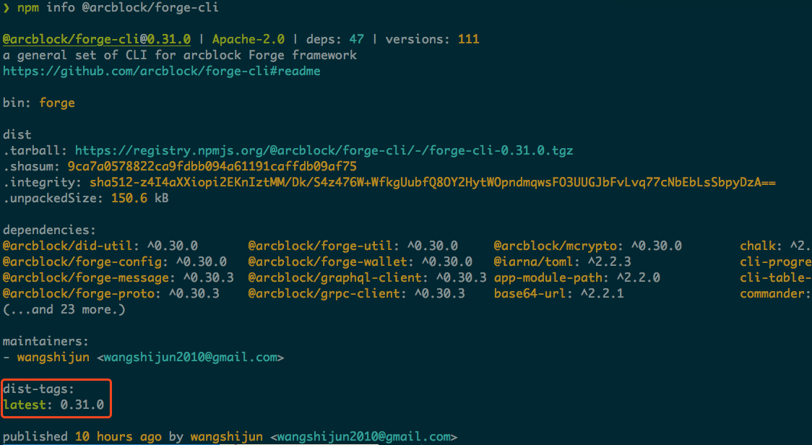

# FAQ

## Why cannot run `forge` with root permission?

Due to limitations of erlang that forge kernel was built upon, forge is not allowed to start with root permission, if you got an root permission error, just follow the [guide](https://github.com/sindresorhus/guides/blob/master/npm-global-without-sudo.md) to fix.

## How to check new release of `@arcblock/forge-cli`?

`forge-cli` will check for new release everyday, you can follow the prompt to upgrade when there is a new version. If you want to check manually, you can run `npm info @arcblock/forge-cli`:



## How to upgrade `@arcblock/forge-cli`?

Just run `npm install -g @arcblock/forge-cli`, then forge-cli will be upgraded to latest version.

## How to check your current install version?

Run `forge version`, all forge component versions are listed:

```shell
✔ forge-core version 0.29.0 on darwin
✔ forge-cli version 0.31.0
✔ consensus engine: tendermint version 0.31.7-8fb2c2a0
```

## How to debug when `forge start` failed?

When `forge start` exits without printing the forge daemon process list, it's very likely that `forge` can not be started on your environment. To get an idea of what's wrong, please run `forge start --dry-run`, then you will get the command to diagnose forge start errors, **similiar to but not the same** as following:

```shell
FORGE_CONFIG=/Users/wangshijun/.forge_cli/forge_release.toml FORGE_RELEASE=/Users/wangshijun/.forge_cli/release/forge /Users/wangshijun/.forge_cli/release/forge_starter/0.29.0/bin/forge_starter start
```

Run the command, and create an issue for us at [https://github.com/ArcBlock/forge-cli/issues](https://github.com/ArcBlock/forge-cli/issues), we will investigate as soon as possible.

## How to cleanup an existing install?

Steps to completely remove an installation of `@arcblock/forge-cli`:

- Cleanup data directory: `forge reset --yes`
- Remove cli directory: `rm -rf ~/.forge_cli`
- Remove cli package: `npm uninstall -g @arcblock/forge-cli`

## How to start forge with custom config or release directory?

Developer can provide different forge config file path and forge release directory at will.

- forge config file path can be provided with `$FORGE_CONFIG`, or `--config-path`
- forge release dir can be provided with `$FORGE_RELEASE_DIR`, or `--release-dir`

And these 2 options can be combined to meet any developer needs to start forge with different config or release.

Here is my configuration to test latest forge master:

```shell
export FORGE_RELEASE_DIR=$HOME/Develop/arcblock/forge/_build/staging/rel
```

When I test with latest forge release:

```shell
export FORGE_RELEASE_DIR=$HOME/.forge_cli/release
```

When I need to start forge with simple custom config:

```shell
export FORGE_CONFIG=/PATH_TO/examples/simple/forge.toml
```

When I need to start forge with nodejs kvstore example config:

```shell
export FORGE_CONFIG=/PATH_TO/examples/kvstore/config/forge.toml
```
